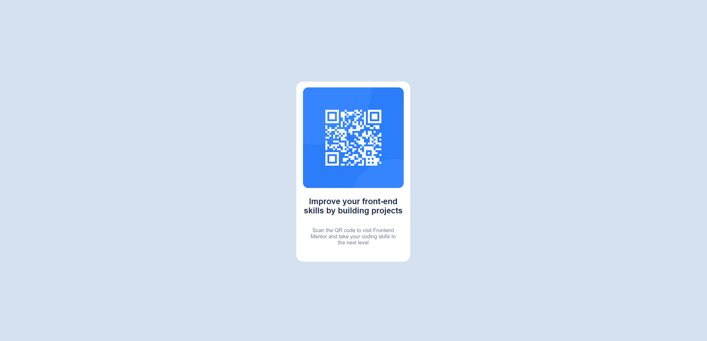
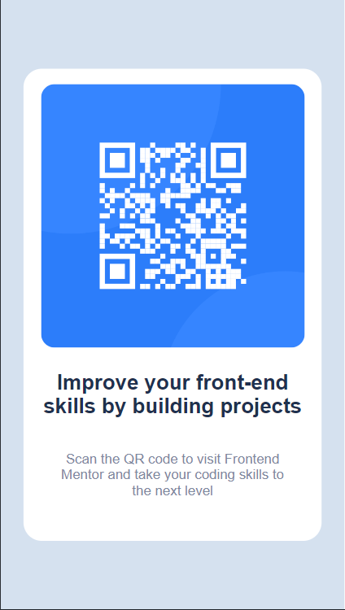

## Table of contents

- [Overview](#overview)
  - [Screenshot](#screenshot)
  - [Links](#links)
- [My process](#my-process)
  - [Built with](#built-with)
  - [What I learned](#what-i-learned)
  - [Continued development](#continued-development)
  - [Useful resources](#useful-resources)
- [Author](#author)

## Overview

### Screenshot

### Links

- Solution URL: [Add solution URL here](https://github.com/LeksoBugadze/frontendmentor-1)
- Live Site URL: [Add live site URL here](https://leksobugadze.github.io/frontendmentor-1/)

## My process

### Built with

- Semantic HTML5 markup
- CSS custom properties
- Flexbox

### What I learned

Learned how to host a live web with git hub pages

## Author

- Website - [Lekso](https://leksobugadze.github.io/frontendmentor-1/)
- Frontend Mentor - [@LeksoBugadze](https://www.frontendmentor.io/profile/LeksoBugadze)

